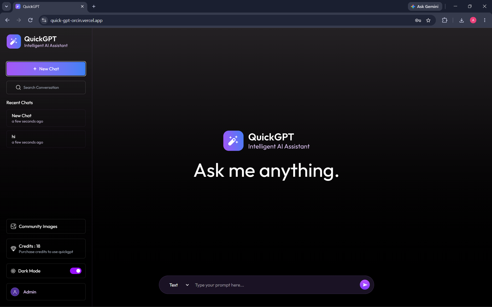
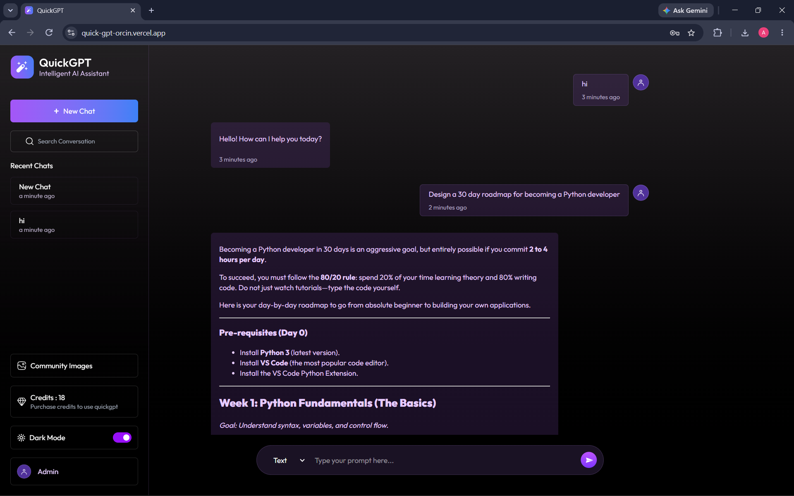
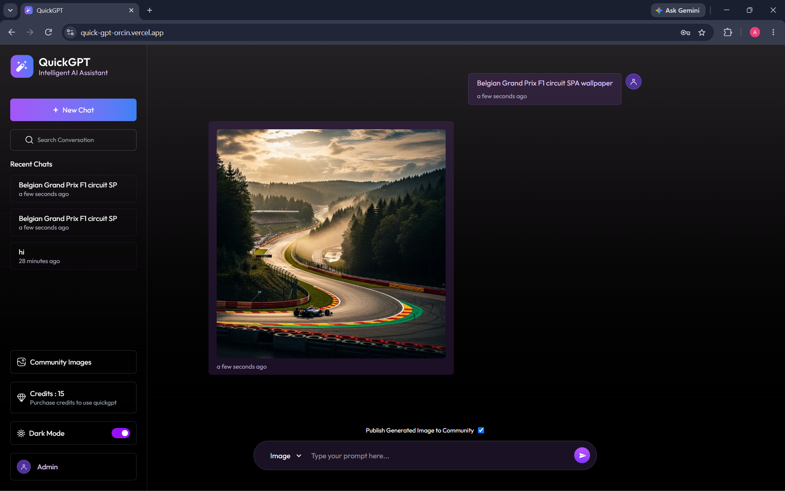
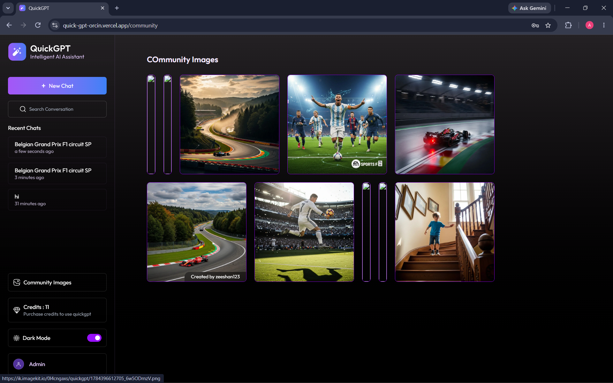
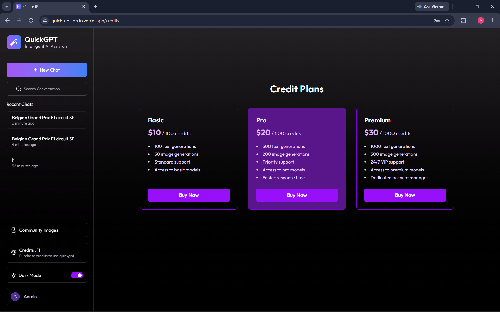
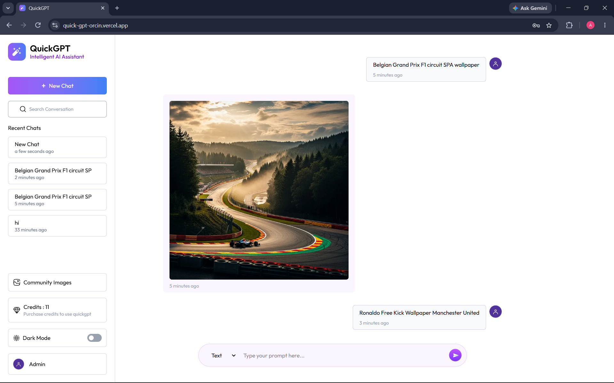
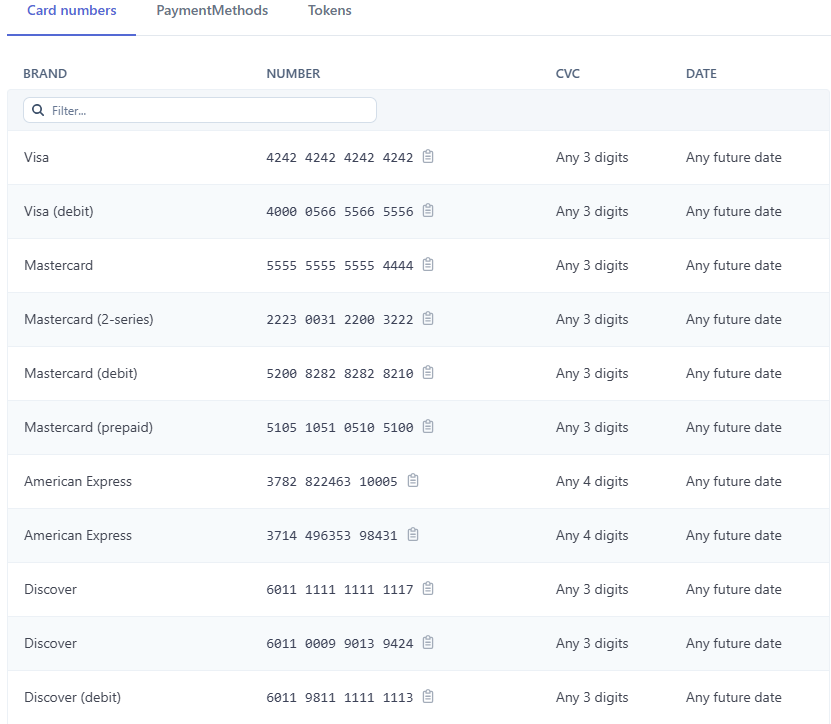

# 🚀 QuickGPT AI

An AI-powered full-stack SaaS application that provides conversational AI, AI image generation, secure authentication, community image sharing, and a credit-based subscription system. Built using the MERN stack with Gemini AI, Stripe payments, ImageKit, and JWT authentication.

---

## 📖 Overview

QuickGPT AI is a modern AI platform where users can:

- Chat with an AI assistant.
- Generate AI images from text prompts.
- Purchase credits securely using Stripe.
- Store conversations and generated images.
- Share generated images with the community.
- Manage account credits and usage.

The application demonstrates complete frontend-backend integration, authentication, payment processing, cloud storage, and AI API integration.

---
## 🌐 Live Demo

**Frontend:** <https://quick-gpt-orcin.vercel.app/>

---

# ✨ Features

### 🤖 AI Chat
- AI-powered conversational assistant
- Markdown support
- Syntax highlighting for code blocks
- Chat history persistence
- Real-time responses

### 🎨 AI Image Generation
- Generate images from prompts
- ImageKit cloud storage integration
- Save generated images
- Community image sharing

### 👤 Authentication
- User Registration
- Secure Login
- JWT Authentication
- Protected Routes
- Session Persistence

### 💳 Credit System
- Credit-based AI usage
- Text generation consumes credits
- Image generation consumes credits
- Real-time credit updates

### 💰 Stripe Payments
- Secure Checkout
- Credit Purchase Plans
- Stripe Webhooks
- Automatic Credit Updates
- Transaction History

### 🌙 User Experience
- Responsive UI
- Dark Mode
- Modern Dashboard
- Loading Screens
- Toast Notifications

---

# 🛠 Tech Stack

## Frontend

- React.js
- Vite
- Tailwind CSS
- React Router
- Axios
- React Markdown
- PrismJS
- React Hot Toast
- Moment.js

## Backend

- Node.js
- Express.js
- MongoDB
- Mongoose
- JWT Authentication
- bcryptjs
- Stripe API
- Gemini AI API
- ImageKit

---

# 📂 Project Structure

```
QuickGPT/
│
├── assets/
│   ├── ai-chat-generation.png
│   ├── ai-image-generation.png
│   ├── community-images.png
│   ├── credits-and-pricing.png
│   ├── home.png
│   ├── light-theme.png
│   └── sample-debit-card.png
│
├── client/
├── server/
├── .gitignore
└── README.md
```

---

# 🔐 Authentication Flow

- User Registration
- Password Encryption using bcrypt
- JWT Token Generation
- Protected API Routes
- Persistent Login
- Secure Logout

---

# 💳 Credit Purchase Flow

1. User selects a credit plan.
2. Stripe Checkout session is created.
3. User completes payment.
4. Stripe Webhook verifies payment.
5. Credits are added automatically.
6. Updated credits appear in the dashboard.

---

# 🎨 Image Generation Flow

1. User enters a prompt.
2. Gemini AI processes the request.
3. Image is generated.
4. Image uploads to ImageKit.
5. Image URL is stored in MongoDB.
6. Community images update instantly.

---

# 💬 AI Chat Flow

1. User sends a message.
2. Request reaches backend API.
3. Gemini AI generates a response.
4. Response is stored in MongoDB.
5. Credits are deducted.
6. Chat updates in real time.

---

# 🗄 Database Models

### User
- Name
- Email
- Password
- Credits
- Profile Image

### Chat
- User ID
- Messages
- Timestamps

### Transaction
- User ID
- Stripe Session
- Credits Purchased
- Payment Status

---

# 📸 Screenshots

## Home Page



---

## AI Chat



---

## AI Image Generation



---

## Community Gallery



---

## Credits & Pricing



---

## Light Theme



---

## Sample Debit Card Details



---

# ⚙ Environment Variables

## Client

```env
VITE_BACKEND_URL=YOUR_BACKEND_URL
```

## Server

```env
PORT=5000

MONGODB_URI=your_mongodb_connection_string

JWT_SECRET=your_jwt_secret

GEMINI_API_KEY=your_gemini_api_key

IMAGEKIT_PUBLIC_KEY=your_imagekit_public_key

IMAGEKIT_PRIVATE_KEY=your_imagekit_private_key

IMAGEKIT_URL_ENDPOINT=your_imagekit_url_endpoint

STRIPE_SECRET_KEY=your_stripe_secret_key

STRIPE_WEBHOOK_SECRET=your_stripe_webhook_secret
```

---

# 🚀 Installation

## Clone Repository

```bash
git clone https://github.com/ishaikhamaan07/QuickGPT.git
```

## Install Frontend

```bash
cd client
npm install
```

## Install Backend

```bash
cd ../server
npm install
```

## Start Backend

```bash
npm run server
```

## Start Frontend

```bash
cd ../client
npm run dev
```

---

# 🚀 Deployment

Frontend

- Vercel

Backend

- Vercel

Database

- MongoDB Atlas

Media Storage

- ImageKit

Payments

- Stripe

---

# 📌 Future Improvements

- Google Authentication
- Chat Search
- Multiple AI Models
- Conversation Export
- Voice Input
- Voice Output
- AI Chat Streaming
- User Profile Settings
- Admin Dashboard
- Image Download History

---

# 📈 Learning Outcomes

This project demonstrates practical implementation of:

- Full Stack MERN Development
- REST API Design
- JWT Authentication
- AI API Integration
- Image Storage
- Payment Gateway Integration
- MongoDB Database Design
- Cloud Deployment
- React State Management
- Secure Backend Development

---


